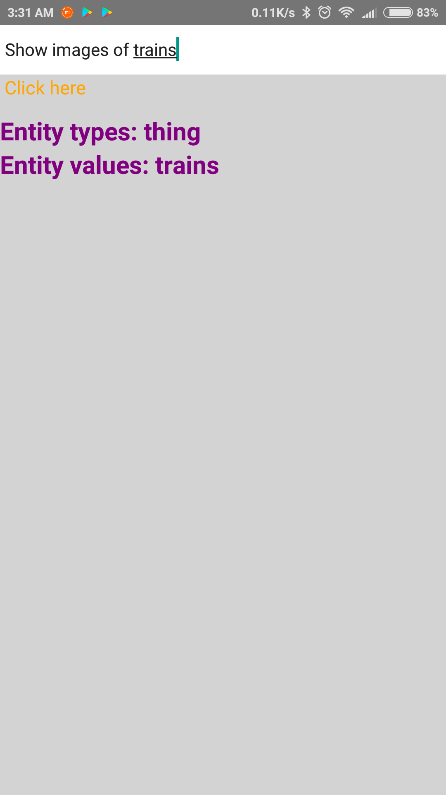
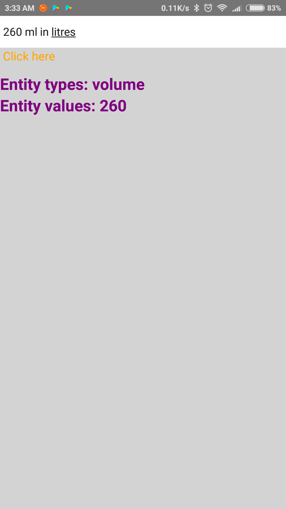
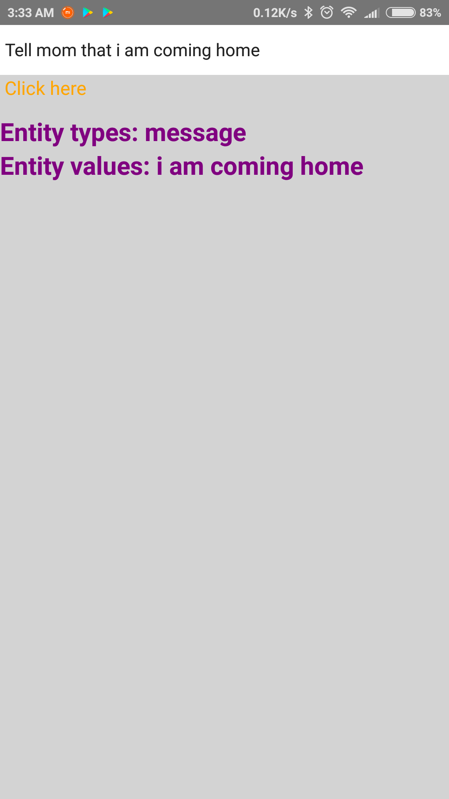
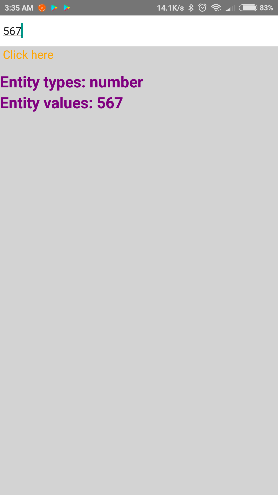

# Instructions for using react-native code

 ## Software Requirements

   Software              |         Version
-----------------------  |   -------------------
   Android studio (IDE)  |         2.2.3
   Android Sdk           |         25.0.2
   Java                  |         1.8.0_121
   Node Js               |         4.2.6
   NPM                   |         3.5.2
  React native cli	      |         2.0.1
                                
                                
 ## React native setup

*	Download the latest node js
* Run the downloaded .msi file and follow the prompts to install
*	Make sure that you  have installed Java Development Kit
*	Download the Android Studio and the SDK tools. And run the .exe file
*	To create the Android Virtual Device(AVD) you have to open the Android Studio and launch the AVD Manager clicking the AVD_Manager       icon. Click on create a new virtual device and configure the device specification
*	After installing node js in your system, you can install react native by typing the following command in the terminal-
  npm install -g react-native-cli
*	A react native project can be made by running the below command in terminal from the folder where we want to create the app
*	To create a react-native project we have to follow the instructions given below:
   * react-native init myapp
   * Go to that folder cd myapp
   * Run the command to start package, make sure you started the emulator
   * In the terminal, type 
      * react-native start
      * react-native run-android
*	The sample project will be opened in the emulator.

## How to use the Wit.ai app

* To run the app download the index.js and wit.js file
* Type an expression in the text-field
* The app will return the recognized entity present in the text
* If the app does not recognize the entity, then a user-friendly message will be displayed
* The link of the apk is given here:
 https://drive.google.com/open?id=1hCw3EckoEA5uEK7cgBLi2r5aCdQfQN7R

## Screenshots of React Native mobile app

           
